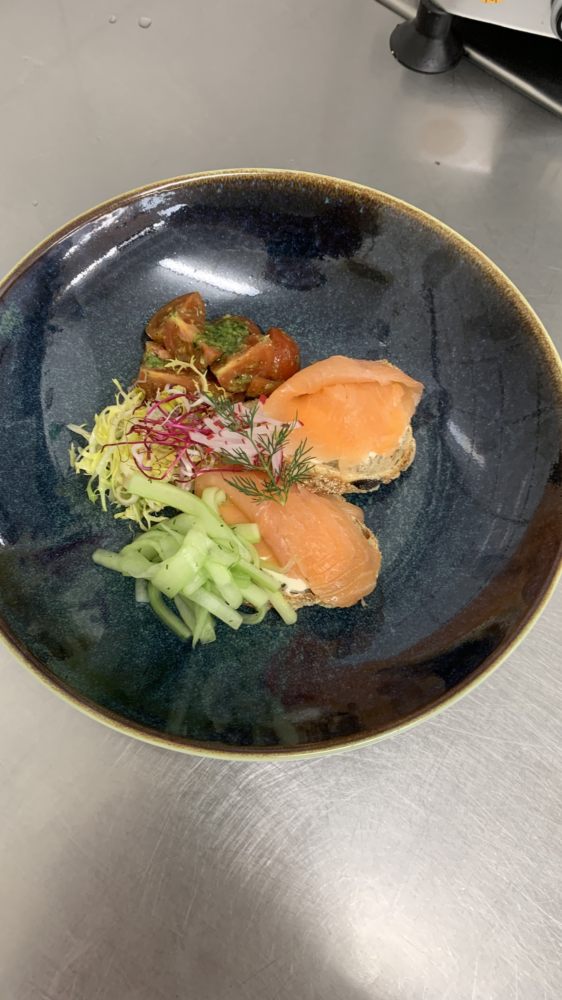
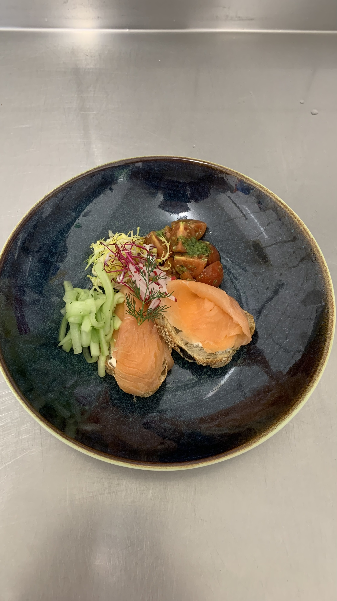

# Räucherlachs mit Ciabatta

Räucherlachs mit Limonen-Schmand auf Ciabatta, an Cherry-Tomatensalat.  
Eine leichte, sommerliche Vorspeise  

??? info "Bilder"

    { width="200", loading=lazy, align=left }
    { width="200", loading=lazy, align=left }

## Zutaten

- Räucherlachs
- Lollo-Rosso
- Ciabatta
- Friese Salat
- Limonen-Schmand
    - 200g Schmand
    - 1 Limette (Saft & Abrieb)
    - 1 Zitrone (Abrieb)
    - Kokusblütenzucker
- Cherrytomaten Salat
    - Cherrytomaten
    - [Basilikum-Pesto](comming soon)
    - Parmesan (gehobelt)

## Zubereitung

1. Limonen-Schmand vorbereiten, hierzu einfach Schmand, Limette, Zitrone zusammen mischen und mit dem Kokusblütenzucker etwas abschmecken.
2. Cherrytomaten Salat vorbereiten.
    1. Cherrytomaten waschen und vierteln.
    2. mit Basilikum-Pesto anmachen und für die weitere Verarbeitung beiseite stellen.
3. Ciabatta aufschneiden und leicht, mit Olivenöl, rösten.
4. Das geröstete Ciabatta mit dem Limonen-Schmand bestreichen und mit Lollo-Rosso garnieren.
5. Den Lachs auf dem Ciabatta anrichten und mit etwas Dill ausgarnieren.

--8<-- "includes/inline_appetizers.md"
