# Consumables

## Eatable

!!! quote "Borsch"

    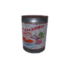{ align=left }
    Selective-fire assault rifle fed from a detachable magazine. Export version of modernized KA-74M with compatible attachments. Uses 5.56x45mm rounds.  
    Ammo:  
    Magazines:

!!! quote "Conflakes"

    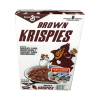{ align=left }
    Selective-fire assault rifle fed from a detachable magazine. Export version of modernized KA-74M with compatible attachments. Uses 5.56x45mm rounds.  
    Ammo:  
    Magazines:

!!! quote "Corn"

    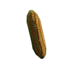{ align=left }
    Selective-fire assault rifle fed from a detachable magazine. Export version of modernized KA-74M with compatible attachments. Uses 5.56x45mm rounds.  
    Ammo:  
    Magazines:

!!! quote "Grilled Fish 1"

    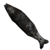{ align=left }
    Selective-fire assault rifle fed from a detachable magazine. Export version of modernized KA-74M with compatible attachments. Uses 5.56x45mm rounds.  
    Ammo:  
    Magazines:

!!! quote "Grilled Fish 2"

    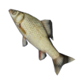{ align=left }
    Selective-fire assault rifle fed from a detachable magazine. Export version of modernized KA-74M with compatible attachments. Uses 5.56x45mm rounds.  
    Ammo:  
    Magazines:

!!! quote "MRE"

    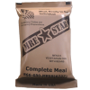{ align=left }
    Selective-fire assault rifle fed from a detachable magazine. Export version of modernized KA-74M with compatible attachments. Uses 5.56x45mm rounds.  
    Ammo:  
    Magazines:

!!! quote "Noodles"

    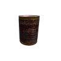{ align=left }
    Selective-fire assault rifle fed from a detachable magazine. Export version of modernized KA-74M with compatible attachments. Uses 5.56x45mm rounds.  
    Ammo:  
    Magazines:

!!! quote "Orange"

    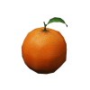{ align=left }
    Selective-fire assault rifle fed from a detachable magazine. Export version of modernized KA-74M with compatible attachments. Uses 5.56x45mm rounds.  
    Ammo:  
    Magazines:

!!! quote "Pumpkin"

    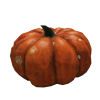{ align=left }
    Selective-fire assault rifle fed from a detachable magazine. Export version of modernized KA-74M with compatible attachments. Uses 5.56x45mm rounds.  
    Ammo:  
    Magazines:

!!! quote "Ralder"

    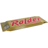{ align=left }
    Selective-fire assault rifle fed from a detachable magazine. Export version of modernized KA-74M with compatible attachments. Uses 5.56x45mm rounds.  
    Ammo:  
    Magazines:

!!! quote "Spinat"

    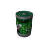{ align=left }
    Selective-fire assault rifle fed from a detachable magazine. Export version of modernized KA-74M with compatible attachments. Uses 5.56x45mm rounds.  
    Ammo:  
    Magazines:

!!! quote "Stickers"

    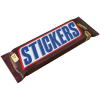{ align=left }
    Selective-fire assault rifle fed from a detachable magazine. Export version of modernized KA-74M with compatible attachments. Uses 5.56x45mm rounds.  
    Ammo:  
    Magazines:

!!! quote "Cooked meat"

    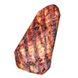{ align=left }
    Selective-fire assault rifle fed from a detachable magazine. Export version of modernized KA-74M with compatible attachments. Uses 5.56x45mm rounds.  
    Ammo:  
    Magazines:

!!! quote "raw meat"

    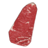{ align=left }
    Selective-fire assault rifle fed from a detachable magazine. Export version of modernized KA-74M with compatible attachments. Uses 5.56x45mm rounds.  
    Ammo:  
    Magazines:

!!! quote "Rice"

    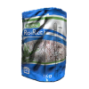{ align=left }
    Selective-fire assault rifle fed from a detachable magazine. Export version of modernized KA-74M with compatible attachments. Uses 5.56x45mm rounds.  
    Ammo:  
    Magazines:

## Drink

!!! quote "7UP"

    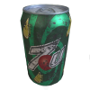{ align=left }
    Selective-fire assault rifle fed from a detachable magazine. Export version of modernized KA-74M with compatible attachments. Uses 5.56x45mm rounds.  
    Ammo:  
    Magazines:

!!! quote "Canteen"

    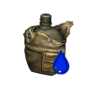{ align=left }
    Selective-fire assault rifle fed from a detachable magazine. Export version of modernized KA-74M with compatible attachments. Uses 5.56x45mm rounds.  
    Ammo:  
    Magazines:

!!! quote "Cola"

    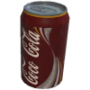{ align=left }
    Selective-fire assault rifle fed from a detachable magazine. Export version of modernized KA-74M with compatible attachments. Uses 5.56x45mm rounds.  
    Ammo:  
    Magazines:

!!! quote "Mountain Dew"

    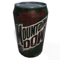{ align=left }
    Selective-fire assault rifle fed from a detachable magazine. Export version of modernized KA-74M with compatible attachments. Uses 5.56x45mm rounds.  
    Ammo:  
    Magazines:

!!! quote "Red Gull"

    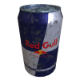{ align=left }
    Selective-fire assault rifle fed from a detachable magazine. Export version of modernized KA-74M with compatible attachments. Uses 5.56x45mm rounds.  
    Ammo:  
    Magazines:

!!! quote "Waterbottle"

    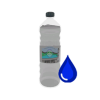{ align=left }
    Selective-fire assault rifle fed from a detachable magazine. Export version of modernized KA-74M with compatible attachments. Uses 5.56x45mm rounds.  
    Ammo:  
    Magazines:

## Medical
